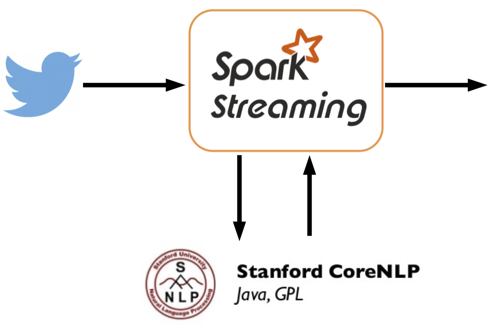
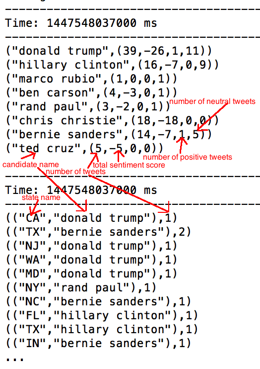

# InstaPoll : Presidential Sentiment
In a recent hackathon, me and my colleague created a large scale sentiment analyis platform for analyzing sentiments of twitter messages. For fun, we decided to use the twitter   messages mentioning the presidential candidates of the upcoming 2016 election. The pipeline we created looked like this:

## Project Pipeline

In the spirit of hackathon, we wrote a hacky python script to get tweets mentioning different presidential candidates. To make our spark streaming job easier in the later stage, we added an additional field 'candidate_name' in each of these tweets. 

We wanted to figure out the location, namely the state from which the tweets are coming from. Even though, twitter api contains a field named 'geocode', this is an optional field - for most of the tweets, this field contains a null value. So, instead we decided to use another field - 'user'/'location'. This is a text field that users can fill up any way they like. This may not be accurate all the time. We create a dictionary look up table to match the text contains in this field to state name and added another filed 'state' in the tweet messages.

We then piped these tweets using a socket to spark streaming job.

The spark streaming jobs use a 60 seconds window to calculate the number of mentions each of the presidential candidates have, the sentiment of these mentions, how many positive tweets each of the candidates are receiving, as well as where the tweets are coming from. The output looked like this:

## Sentiment Analysis

For this project, we decided to use the [CoreNLP](http://nlp.stanford.edu/software/corenlp.shtml) package available from Stanford University. The sentiment model in CoreNLP package is trained using a Recursive Neural Network - details of the model can be found in this seminal [paper](http://nlp.stanford.edu/~socherr/EMNLP2013_RNTN.pdf). The model is currently the state of the art in sentiment analysis of text. Stanford CoreNLP is a java package. Initially, we were thinking of using python to write the spark streaming job - however, due the imcompatibility of python with the CoreNLP java package, we ended up using Scala to write the spark streaming code - plus its always fun to be [functional](https://en.wikipedia.org/wiki/Functional_programming).